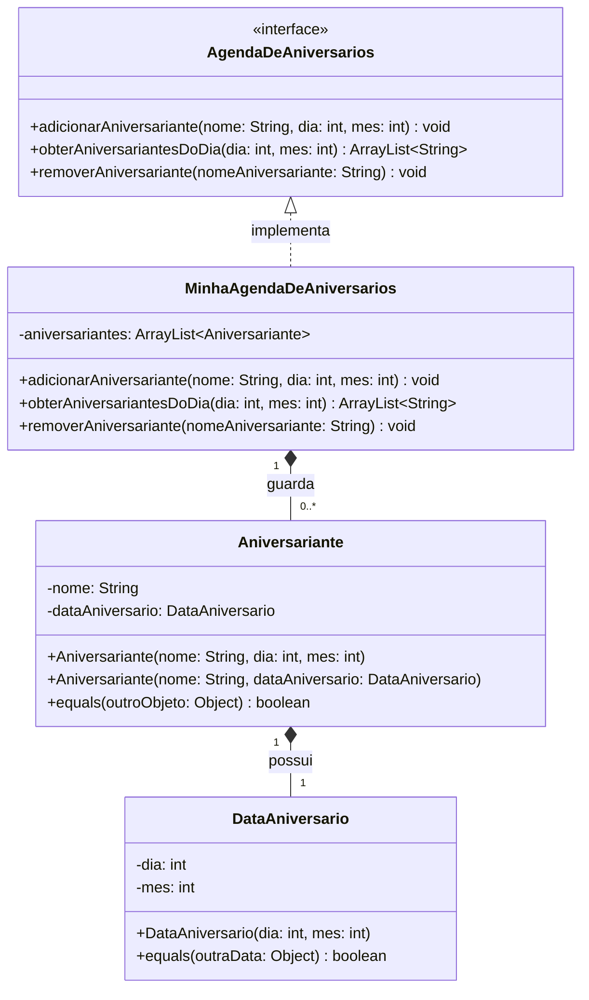

# Exercício 01 — Agenda de aniversários

## Diagrama de classes

Os nomes são comparados exatamente como informados, inclusive quanto a letras maiúsculas e
minúsculas. A interface original não define validação de faixa para dia e mês; portanto, esta
solução não acrescenta uma regra que não consta no enunciado.
